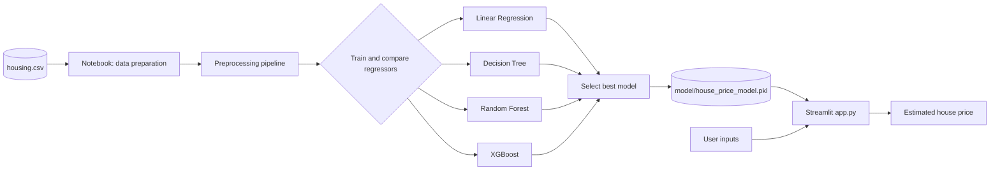
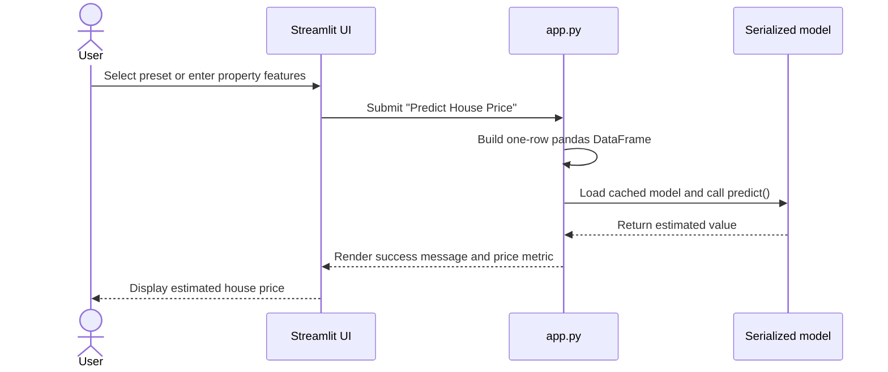

<div align="center">

# 🏡 Housing Price Predictor

### A machine-learning powered Streamlit application for estimating California house values

<p>
  <a href="https://github.com/Samarssj/Housing-price-predictor/stargazers"></a>
  <a href="https://github.com/Samarssj/Housing-price-predictor/network/members"></a>
</p>

<p>
  <a href="https://house-price-predictor-pied.vercel.app"><strong>Live project link</strong></a>
  ·
  <a href="https://github.com/Samarssj/Housing-price-predictor/issues">Report an issue</a>
</p>

</div>

---

## Overview

**Housing Price Predictor** turns a small set of property and location attributes into an estimated house value through an interactive web interface. The project combines a reproducible Jupyter Notebook workflow with a Streamlit front end, allowing users to experiment with features such as median income, room counts, location, and ocean proximity.

The repository contains the California housing dataset, the model-development notebook, and the Streamlit application. The notebook compares four regression approaches—Linear Regression, Decision Tree, Random Forest, and XGBoost—using standard regression metrics before the selected model is consumed by the application.[1] [2]

> **Important runtime note:** `app.py` expects a serialized model at `model/house_price_model.pkl`. That artifact is not currently checked into this repository, so the model must be exported to that path before launching the Streamlit application.

## Highlights

| Capability | What it provides |
| --- | --- |
| Interactive prediction form | Users can enter geographic, demographic, and property inputs directly in the browser. |
| Ready-made scenarios | Affordable Home, Large Family Home, and Coastal Property presets make the interface easy to explore. |
| Multiple-model experimentation | The notebook compares four regression families before selecting a best-performing model. |
| Mixed-type preprocessing | Numerical features are imputed and scaled, while the categorical ocean-proximity feature is one-hot encoded. |
| Cached inference | Streamlit resource caching avoids repeatedly loading the serialized model during a session. |
| Explainable project layout | Dataset, experimentation notebook, inference app, and dependencies are kept in clearly named files. |

## Technology stack

<div align="center">

[](https://www.python.org/)
[](https://pandas.pydata.org/)
[](https://scikit-learn.org/)
[](https://xgboost.readthedocs.io/)
[](https://jupyter.org/)
[](https://streamlit.io/)
[](https://numpy.org/)
[](https://joblib.readthedocs.io/)

</div>

| Layer | Technologies |
| --- | --- |
| Language | Python 3.11+ |
| Data handling | Pandas, NumPy |
| Machine learning | Scikit-learn, XGBoost |
| Experimentation | Jupyter Notebook |
| Web interface | Streamlit |
| Model persistence | Joblib |
| Dataset | California housing data in `housing.csv` |

## Architecture

The project follows a simple **offline-training / online-inference** architecture. Model exploration and preprocessing live in the notebook, while `app.py` is intentionally focused on loading the chosen artifact, collecting user input, and returning a prediction.



### Architecture responsibilities

| Component | Responsibility |
| --- | --- |
| `housing.csv` | Supplies the source records used during experimentation. |
| `housing_price_prediction.ipynb` | Loads data, separates features and target, builds preprocessing pipelines, trains candidate regressors, evaluates them, and demonstrates prediction. |
| Preprocessing pipeline | Applies median imputation and standard scaling to numerical columns and one-hot encoding to `ocean_proximity`. |
| `model/house_price_model.pkl` | Stores the fitted model artifact expected by the application at runtime. |
| `app.py` | Renders the Streamlit interface, accepts feature values, constructs a one-row DataFrame, and displays the predicted value. |

## Prediction flow

The runtime path from a user action to a displayed estimate is intentionally short:



## Repository structure

```text
Housing-price-predictor/
├── app.py                              # Streamlit inference interface
├── housing.csv                         # Housing dataset
├── housing_price_prediction.ipynb      # Data preparation, training, and evaluation workflow
├── requirements.txt                    # Core Python dependencies
├── .gitignore
└── README.md
```

The runtime model directory is intentionally shown separately because the expected `model/house_price_model.pkl` artifact is not part of the current checkout:

```text
model/
└── house_price_model.pkl               # Required by app.py at runtime
```

## Getting started

### 1. Clone the repository

```bash
git clone https://github.com/Samarssj/Housing-price-predictor.git
cd Housing-price-predictor
```

### 2. Create an isolated environment

```bash
python -m venv .venv
source .venv/bin/activate       # macOS/Linux
# .venv\Scripts\activate      # Windows PowerShell
```

### 3. Install dependencies

The checked-in `requirements.txt` contains the core data-science and model-persistence packages. The Streamlit interface also requires Streamlit itself.

```bash
python -m pip install --upgrade pip
pip install -r requirements.txt streamlit jupyter
```

### 4. Prepare the model artifact

Run the cells in `housing_price_prediction.ipynb` to reproduce the data-preparation and model-comparison workflow. Export the selected fitted model with Joblib to the path consumed by `app.py`:

```python
from pathlib import Path
import joblib

Path("model").mkdir(exist_ok=True)
joblib.dump(best_model, "model/house_price_model.pkl")
```

The variable `best_model` should refer to the fitted estimator selected after comparing the candidate regressors. Because the application expects the complete fitted pipeline, export the pipeline that includes preprocessing rather than only the final regressor.

### 5. Launch the application

```bash
streamlit run app.py
```

Streamlit will print a local URL. Open it in a browser, choose a sample scenario or enter custom values, and select **Predict House Price**.

## Input features

The application builds a prediction record from the following fields. Numerical values are entered with Streamlit number controls, while ocean proximity is selected from a fixed categorical list.

| Feature | Type | Description |
| --- | --- | --- |
| `longitude` | Numerical | Geographic longitude of the district. |
| `latitude` | Numerical | Geographic latitude of the district. |
| `housing_median_age` | Numerical | Median age of houses in the district. |
| `total_rooms` | Numerical | Total rooms reported for the district. |
| `total_bedrooms` | Numerical | Total bedrooms reported for the district. |
| `population` | Numerical | District population. |
| `households` | Numerical | Number of households in the district. |
| `median_income` | Numerical | Median income value used by the trained model. |
| `ocean_proximity` | Categorical | Location category such as `INLAND`, `NEAR BAY`, or `<1H OCEAN`. |

## Model-development workflow

The notebook uses an 80/20 train-test split with a fixed random state, prepares mixed numerical and categorical columns through a Scikit-learn `ColumnTransformer`, and evaluates candidate regressors with **mean squared error** and **R² score**. The selected fitted pipeline is then intended to be persisted with Joblib for reuse by the Streamlit front end.[1] [2] [3]

| Model | Role in the comparison |
| --- | --- |
| Linear Regression | Interpretable baseline for approximately linear relationships. |
| Decision Tree Regressor | Captures non-linear decision boundaries through recursive splits. |
| Random Forest Regressor | Uses an ensemble of trees to improve robustness. |
| XGBoost Regressor | Gradient-boosted tree model used for high-capacity regression. |

## Development notes

This project is structured as a learning-friendly end-to-end machine-learning demonstration rather than a production prediction service. For a production deployment, consider adding an explicit training script, automated artifact generation, data validation, model-version metadata, input-range validation, and tests for both preprocessing and inference.

Potential next steps include hyperparameter tuning, feature-importance visualization, SHAP-based explanations, a dedicated API layer, containerized deployment, and a CI workflow that validates the notebook and application on every change.

## Contributing

Contributions are welcome. Create a focused branch, make the change, test the notebook or application path affected by the change, and open a pull request with a concise explanation of the improvement.

## Author

**Samar Singh** — [@Samarssj](https://github.com/Samarssj)

If this project helped you learn or prototype a housing-price model, consider giving the repository a star.

## References

[1]: https://github.com/Samarssj/Housing-price-predictor "Housing Price Predictor repository"
[2]: https://scikit-learn.org/stable/modules/compose.html "Scikit-learn composite estimators and preprocessing"
[3]: https://xgboost.readthedocs.io/en/stable/ "XGBoost documentation"
[4]: https://streamlit.io/ "Streamlit"
